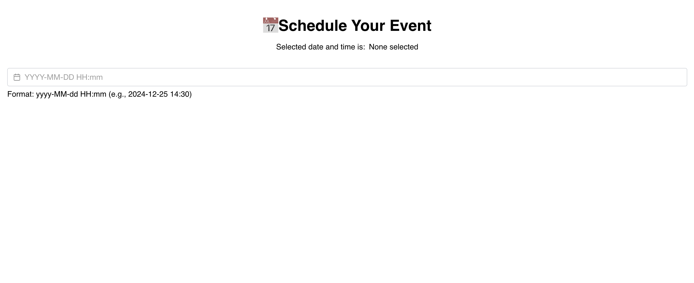

# 📅 Nuxt 3 + Vuetify Date & Time Picker

This is a simple project I made using **Nuxt 3** and **Vuetify** where users can select a date and time, and see the selected value formatted below.




---

## How I Set It Up

### 1. Create Nuxt App

````bash
npx nuxi init datetime-input-demo
cd datetime-input-demo
npm install

### 2. Install Vuetify

```bash
npm install vuetify
````

### 3. Create Vuetify Plugin

In `plugins/vuetify.ts`, I added:

```ts
import { createVuetify } from "vuetify";
import * as components from "vuetify/components";
import * as labs from "vuetify/labs/components";
import * as directives from "vuetify/directives";
import "vuetify/styles";

export default defineNuxtPlugin((nuxtApp) => {
  const vuetify = createVuetify({
    components: {
      ...components,
      ...labs,
      VDateInput,
      VTimePicker,
    },
    directives,
    ssr: true,
  });

  nuxtApp.vueApp.use(vuetify);
});
```
