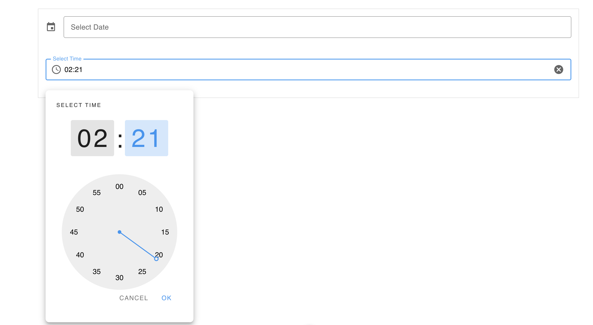

# 📅 Nuxt 3 + Vuetify Date & Time Picker

This is a simple project I made using **Nuxt 3** and **Vuetify** where users can select a date and time, and see the selected value formatted below.





---

## How I Set It Up

### 1. Create Nuxt App

```bash
npx nuxi init datetime-input-demo
cd datetime-input-demo
npm install

### 2. Installed Vuetify
```bash
npm install vuetify

